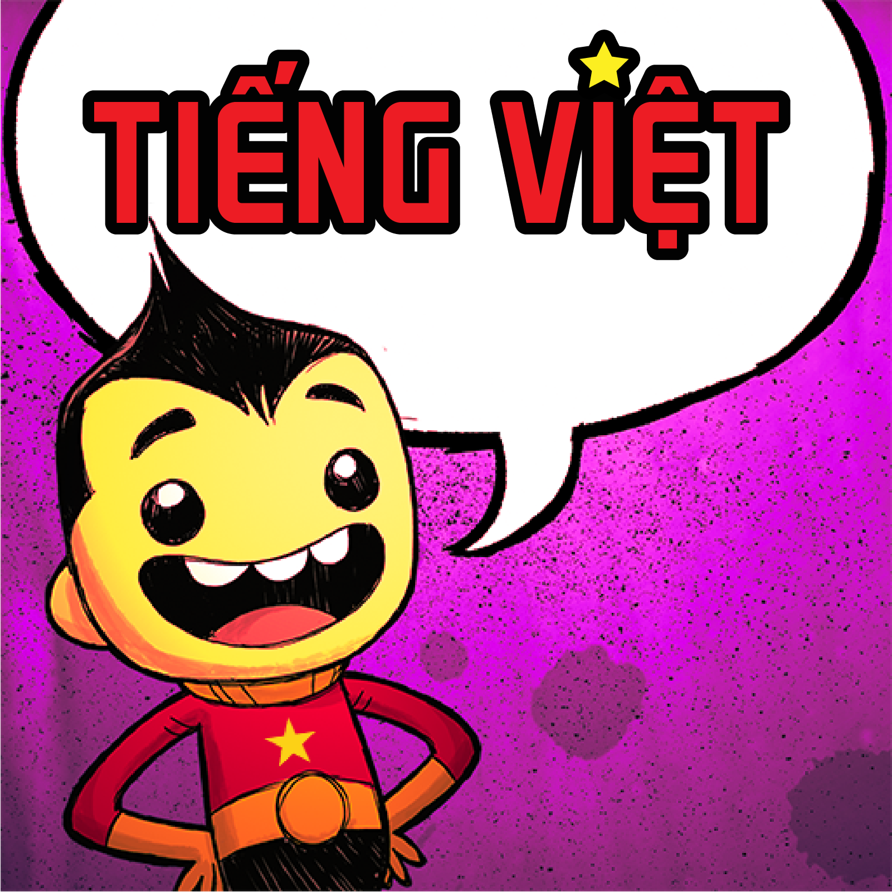

# ONI Vietnamese Beautiful Font

[](https://steamcommunity.com/sharedfiles/filedetails/?id=2574634278)
[](https://steamcommunity.com/sharedfiles/filedetails/?id=2574634278)



Mod thay font cho **Oxygen Not Included** — hỗ trợ hiển thị tiếng Việt với font đẹp hơn font mặc định.

Tương thích với ONI build **719533+** (March 2026 update), hỗ trợ tất cả DLC.

## Cách hoạt động

- Load font `.otf`/`.ttf` trực tiếp lúc runtime (không cần AssetBundle)
- Tạo `TMP_FontAsset` và pre-populate atlas với bộ ký tự Vietnamese + ASCII
- **Heading** (GRAYSTROKE): thêm font custom làm fallback — game giữ font gốc, chỉ dùng custom font cho ký tự thiếu
- **Body text** (Roboto, NotoSans, ...): replace trực tiếp bằng RobotoCondensed có đầy đủ tiếng Việt, match đúng variant (Regular/Bold/Italic/BoldItalic)
- Đọc `config.json` để cấu hình font heading, ngôn ngữ, hướng text, scale

## Cài đặt

### Steam Workshop (khuyến nghị)

1. Đăng ký mod **[ONI Tiếng Việt](https://steamcommunity.com/sharedfiles/filedetails/?id=2574634278)** trên Steam Workshop
2. Bật mod trong game, khởi động lại
3. Vào **Settings → Language** chọn **Tiếng Việt**

### Cài nhanh bằng script

```bash
curl -sL https://raw.githubusercontent.com/sant1ago-da-hanoi/oni-vie-beautiful-font/master/install.sh | bash
```

Script tự detect OS, tải bản mới nhất từ GitHub Releases, và cài vào thư mục local mod.

### Cài thủ công (local mod)

1. Tải zip từ [Releases](https://github.com/sant1ago-da-hanoi/oni-vie-beautiful-font/releases) (hoặc build DLL theo hướng dẫn bên dưới)
2. Giải nén vào thư mục local mod:
   ```
   # macOS
   ~/Library/Application Support/unity.Klei.Oxygen Not Included/mods/Local/VieBeautifulFont/

   # Windows
   %USERPROFILE%\Documents\Klei\OxygenNotIncluded\mods\Local\VieBeautifulFont\
   ```
   Cấu trúc thư mục:
   ```
   VieBeautifulFont/
   ├── oni-vietnamese.dll
   ├── mod_info.yaml
   ├── mod.yaml
   ├── config.json
   ├── preview.png
   └── Fonts/
       ├── GRAYSTROKE_REGULAR.otf
       ├── RobotoCondensed-Regular.ttf
       ├── RobotoCondensed-Bold.ttf
       ├── RobotoCondensed-Italic.ttf
       └── RobotoCondensed-BoldItalic.ttf
   ```
3. Mở game → **Mods** → bật **VieBeautifulFont** → khởi động lại
4. Vào **Settings → Language** chọn **Tiếng Việt**

> **Lưu ý:** Nếu đang dùng bản Workshop, tắt mod Workshop trước khi bật local mod để tránh conflict.

## Cấu hình

File `config.json` trong thư mục mod:

```json
{
  "filename": "GRAYSTROKE_REGULAR.otf",
  "code": "vi",
  "leftToRight": true,
  "scale": 1.0
}
```

| Field | Mô tả |
|-------|--------|
| `filename` | Tên file font heading `.otf` trong thư mục `Fonts/` |
| `code` | Mã ngôn ngữ (`vi`, `zh`, ...) |
| `leftToRight` | Hướng text — `true` cho LTR, `false` cho RTL |
| `scale` | Tỉ lệ font (1.0 = mặc định) |

## Build

Yêu cầu:
- .NET SDK 6.0+ (hoặc bất kỳ version nào hỗ trợ `netstandard2.1`)
- Game Oxygen Not Included đã cài qua Steam

Project tự detect đường dẫn game DLLs trên macOS, Windows, và Linux (Steam default paths). Nếu cài ở chỗ khác, set property `ONIManagedDir` khi build.

```bash
dotnet build oni-vietnamese.csproj
```

Output: `bin/Debug/netstandard2.1/oni-vietnamese.dll`

Custom game path:
```bash
dotnet build oni-vietnamese.csproj -p:ONIManagedDir="/path/to/OxygenNotIncluded_Data/Managed"
```

## License

MIT
